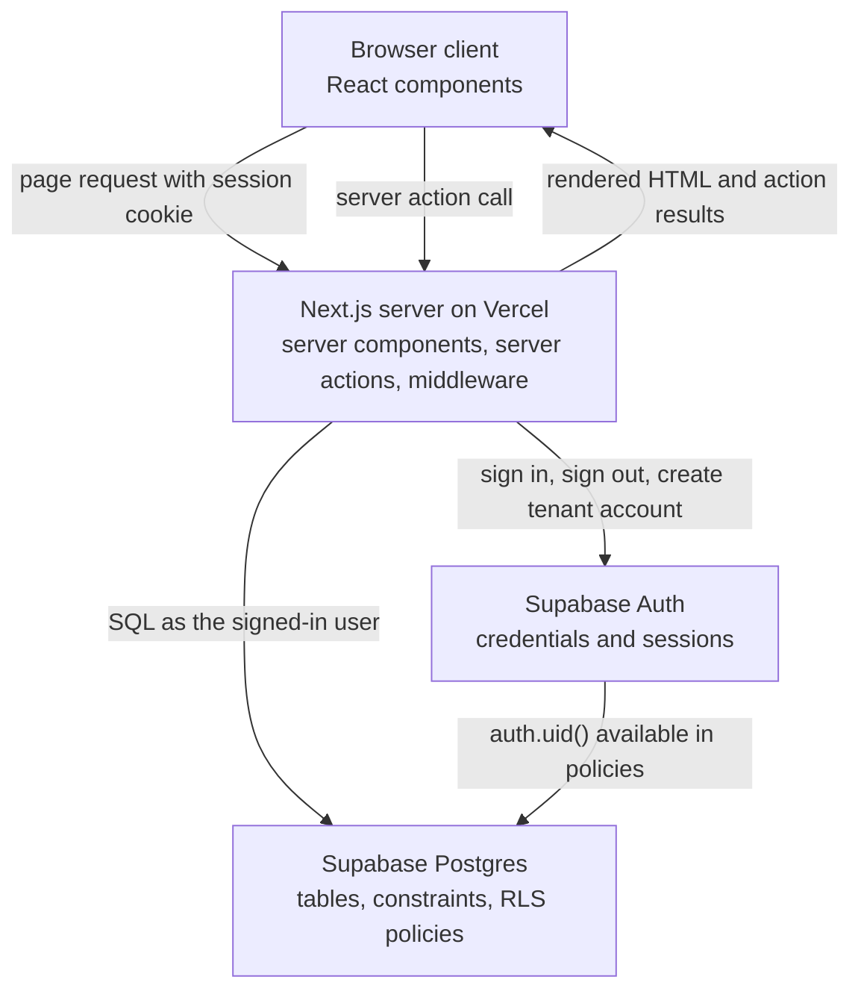
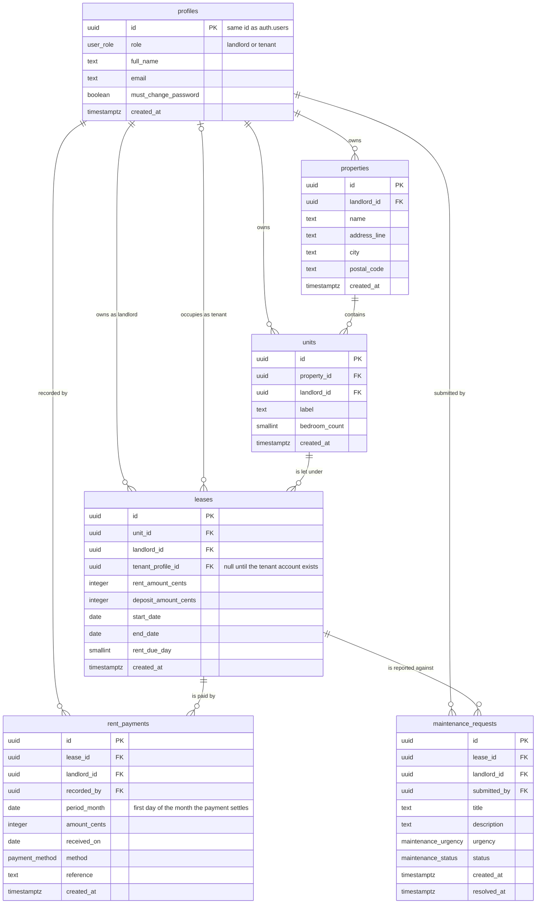

# Technical Plan

Rental management app for small landlords, with a tenant portal.

This document turns [the product specification](01-product-specification.md) into a buildable
design. Product decisions are not revisited here; where this document makes a choice, it explains
the alternative it rejected. Section references such as P3, C5, or G2 point at processes,
capabilities, and business goals in the product specification.

---

# Part One: Architecture

## 1. System components

Five components, three of which we write.

| # | Component | What it is | What it is responsible for |
| --- | --- | --- | --- |
| 1 | Browser client | React components marked `"use client"`, running in the user's browser | Form input, client-side validation for fast feedback, pending states while a server action runs, printing the statement page. Holds no application data of its own |
| 2 | Next.js server | App Router application running on Vercel: server components, server actions, and middleware | Renders every page on the server, holds the session, runs every write, and is the only place that talks to the database |
| 3 | Supabase Postgres | Managed Postgres with Row Level Security enabled on every table | Stores all application data. Enforces the domain invariants as constraints, and enforces authorisation as RLS policies |
| 4 | Supabase Auth | Managed identity service, backed by the `auth` schema in the same Postgres instance | Holds credentials, hashes passwords, issues and refreshes sessions. `auth.uid()` is the identity RLS policies read |
| 5 | Vercel | Hosting and delivery | Serves the application at a public URL, holds the environment variables, runs the production build |



The important property of this diagram is what is missing: the browser never talks to Supabase.
There is no client-side database call anywhere in the product. Every read happens in a server
component and every write happens in a server action, so the session is never handled by client
code and the anonymous key is never used to fetch application data.

## 2. Why Postgres, and why through Supabase

### Why a relational database

The data is relational in the ordinary sense: a landlord has properties, a property has units, a
unit has leases over time, a lease has payments and maintenance requests. Every read in the product
walks those relationships.

More importantly, two of the five product rules are constraints, not behaviour:

- A unit is never under two overlapping leases (P3, rule 1).
- A payment always belongs to exactly one lease, and a lease always belongs to exactly one unit
  (G7, rule 5).

Postgres can enforce both in the database itself: the first as an exclusion constraint over date
ranges, the second as foreign keys. A rule enforced by the database cannot be bypassed by a bug in
an application code path, and there will be more application code paths at the end of the project
than there are today.

### Why Supabase rather than the alternatives

| Option | Why not |
| --- | --- |
| Firebase or another document database | The overlapping-lease rule has no equivalent to an exclusion constraint, so it would have to be a read-then-write check in application code, which is a race condition by construction. Referential integrity would also become application code |
| Self-hosted Postgres | Same database, plus backups, upgrades, connection management, and an identity service to build or integrate. None of that work is visible in the deliverable |
| Postgres with a separate auth provider and an ORM | Workable, but identity then lives outside the database, so authorisation cannot be expressed as a database policy and has to be enforced in application code only. That is exactly the boundary this project wants in the database |

Supabase is chosen because Auth and Postgres are the same instance. That single fact is what makes
`auth.uid()` available inside a policy, which is what lets authorisation live next to the data. The
managed platform, the free tier, and the SQL migrations checked into the repository are secondary
benefits.

## 3. Central entities

Six tables, exactly as agreed: `profiles`, `properties`, `units`, `leases`, `rent_payments`,
`maintenance_requests`.



Three modelling decisions in this diagram deserve defending, because a reader will ask about all
three.

**There is no rent periods table.** The rent schedule of a lease is a pure function of four values
already on the lease: start date, end date, monthly rent, and rent due day. Storing the periods
would create a second copy of information the lease already contains, which can then disagree with
it after any edit. The schedule is generated in TypeScript on read, and payments reference a period
by its month (`period_month`). This is what makes rule 2, "status is always derived", structurally
true rather than merely intended: there is nowhere to write a status even if someone wanted to.

**There is no lease status column.** Whether a lease is upcoming, active, or ended is a comparison
between today and two dates that are already stored. A status column would be a cached answer to
that comparison, and a cached answer needs a job to keep it current. Early termination is recorded
by changing the end date, which is what actually happened.

**`landlord_id` is carried on every owned table, but the tenant is not.** Ownership never changes
during the life of a row, so denormalising it lets every landlord policy be a single equality
against `auth.uid()` with no join. Tenant assignment does change, since a tenant account can be
created after the lease and can be replaced, so tenant access is resolved through the lease at read
time rather than copied onto child rows where it would drift.

## 4. Every page

Routes are grouped by area, and the area in the URL is what the middleware and the layouts key off.
Every page listed here is a server component unless the table says otherwise.

### 4.1 Public and authentication pages

| Route | Purpose | Who reaches it |
| --- | --- | --- |
| `/` | Not a landing page. A signed-out visitor is sent to `/login` by the middleware, and a signed-in one is sent to their own area | Anyone |
| `/login` | Email and password sign in for both roles | Signed-out users |
| `/register` | Landlord registration. Tenants cannot register here; they are created by their landlord (P1) | Signed-out users |
| `/change-password` | Sets a new password. Forced for any profile with `must_change_password` set, and reachable voluntarily afterwards | Any signed-in user |

### 4.2 Landlord area, under `/landlord`

| Route | Purpose | Data read |
| --- | --- | --- |
| `/landlord` | The attention dashboard (C7). Rent collected this month, what is outstanding, open problems, occupancy, and tenancies ending within sixty days. Four database round trips, three of them aggregates, and no payment row | `rent_collected_by_month`, `lease_rent_summary`, two counts |
| `/landlord/rent` | What every tenancy has been charged so far, what has arrived and what is left, read from the `lease_rent_summary` aggregate rather than from the payments | One aggregate row per tenancy |
| `/landlord/properties` | Every property, with unit counts | Properties, unit counts |
| `/landlord/properties/new` | Create a property | None |
| `/landlord/properties/[propertyId]` | One property and its units, each showing its occupancy derived from its tenancies. Units are a plain table: a building has as many as it has, and the number does not grow with time | Property, units, their leases and tenant names |
| `/landlord/properties/[propertyId]/edit` | Edit or delete a property | Property |
| `/landlord/properties/[propertyId]/units/new` | Add a unit to a property | Property |
| `/landlord/units/[unitId]/edit` | Edit or delete a unit | Unit |
| `/landlord/leases` | Every lease, filtered by lifecycle through the URL query with the same comparison `describeLeaseLifecycle` makes | Leases, units, properties, tenant names |
| `/landlord/leases/new` | Create a lease, optionally pre-filled with a unit from the query string | Units without a current lease |
| `/landlord/leases/[leaseId]` | The centre of the landlord's day: lease terms, the derived rent schedule with a status per period, the payment ledger, tenant access, and the link to the statement | Lease, unit, property, tenant profile, payments |
| `/landlord/leases/[leaseId]/end` | End a tenancy early. Only the end date moves | Lease |
| `/landlord/leases/[leaseId]/renew` | Record the next tenancy on the same unit for the same tenant, offered from the day after this one ends | Lease, tenant |
| `/landlord/leases/[leaseId]/payments/new` | Record a payment received, pre-selecting the oldest unpaid period | Lease, derived schedule |
| `/landlord/leases/[leaseId]/payments/[paymentId]/edit` | Correct or delete a recorded payment | Payment, lease |
| `/landlord/leases/[leaseId]/statement` | Print-optimised rent statement for a month range taken from the URL query (C10). The lease id is not trusted: a lease belonging to another landlord is answered as not found | Lease, payments in range |
| `/landlord/maintenance` | Every request across the portfolio, filterable by status through the URL query | Requests, leases, units |
| `/landlord/maintenance/[requestId]` | One request, with the status controls | Request, lease, unit, tenant |

### 4.3 Tenant area, under `/tenant`

| Route | Purpose | Data read |
| --- | --- | --- |
| `/tenant` | The answer to the only question most tenants have: the current period, its status, and the amount outstanding, with the lease summary underneath | Own lease, own payments |
| `/tenant/lease` | Full lease terms: unit, address, dates, rent, due day, deposit, and the landlord's name and email | Own lease, unit, property, landlord profile |
| `/tenant/payments` | The full schedule and every payment recorded against it | Own lease, own payments |
| `/tenant/statement` | The same statement, with no lease id in the URL at all: the tenancy is resolved from the session, so a statement for somebody else's lease is not a request this route can express | Own lease, own payments |
| `/tenant/maintenance` | The tenant's own requests and their current statuses | Own requests |
| `/tenant/maintenance/new` | Submit a request (P5) | Own lease |
| `/tenant/maintenance/[requestId]` | One request and its history | Own request |

A tenant whose lease has ended keeps every one of these pages. The data is theirs and the product
spec requires that it stay reachable; only `/tenant/maintenance/new` is closed, because there is no
active lease to report against.

## 5. Server actions and route handlers

### 5.1 The rule that decides which one

A **server action** is the right choice when a signed-in user submits a form and expects the page to
reflect the result. It is a function call from a React component, so its input is typed end to end,
it cannot be reached without a valid session cookie, Next.js protects it against cross-site
submissions, and `revalidatePath` refreshes the affected server components afterwards. Every write
in this product fits that description.

A **route handler** is the right choice when something that is not our own React tree needs to speak
HTTP to us: an inbound webhook, a third-party redirect back into the application, a machine-readable
API for another client, or a response that is a file rather than a page.

### 5.2 Which route handlers this project needs

One: `GET /api/health`.

It is the case the rule describes: something that is not our own React tree speaking HTTP to us. A
scheduled GitHub Actions workflow calls it once a day, and it answers with JSON. It exists because a
Supabase project on the free plan is paused after about a week without activity, so it makes a real
query against Postgres rather than answering statically. It needs no session, exposes nothing, and
is the only path the proxy lets through unauthenticated. See
[docs/04-deployment.md](04-deployment.md).

Everything else the product does is a page render or a form submission, so nothing else is one:

| Case that would otherwise need a route handler | Why it does not arise here |
| --- | --- |
| Payment provider webhook | The product records payments and never processes them, so no provider ever calls us |
| Email or magic-link callback | There is no email service anywhere in this project. Sign-in is email and password against Supabase Auth, and the session cookie is set inside a server action |
| OAuth provider redirect | No third-party sign-in |
| PDF or CSV download endpoint | The rent statement is a print-optimised page the browser saves as PDF. No file is generated on the server |
| Public read API for another client | There is no other client |

If any of those five ever became true, the corresponding route handler would be added and this table
is where the reason would be recorded, as the health check is recorded above it. `src/proxy.ts` also runs on every request, but the proxy file
(Next.js 16's renamed middleware convention) is not a route handler: it refreshes the Supabase
session cookie and redirects unauthenticated or wrong-role requests before a page renders.

### 5.3 The actions themselves

Every server action is listed with its inputs, output, and failure modes in
[Part Two, section 13](#13-api-description-every-server-action). They are grouped by entity and all
share one shape, described in section 13.1.

## 6. Data flow

### 6.1 The read path, once

A landlord opens `/landlord/leases/[leaseId]`.

1. The browser sends a GET request carrying the Supabase session cookie.
2. `src/proxy.ts` runs, which is Next.js 16's renamed middleware convention. It creates a Supabase server client bound to the request cookies, refreshes
   the session if the access token is close to expiry, writes any refreshed cookie back onto the
   response, and lets the request continue. If there is no session it redirects to `/login`.
3. The `/landlord` layout, a server component, loads the signed-in profile and checks that the role
   is `landlord`. A tenant reaching this URL is redirected to `/tenant`.
4. The page, a server component, creates a Supabase server client and issues its queries: the lease
   with its unit and property, the tenant profile, and every payment for the lease.
5. Postgres runs those queries **as the signed-in user**. Every RLS policy on every table in the
   query is applied. A lease belonging to a different landlord returns zero rows, so the page treats
   it exactly as a lease that does not exist and renders `not-found`.
6. The page passes the rows to `buildRentSchedule` and `deriveRentStatus`, both pure functions, to
   produce the period list with a status and an outstanding amount per period.
7. The page renders HTML and streams it to the browser. Client components in the tree receive their
   data as props; they do not fetch.

No data-fetching library, no client state store, and no API layer appear anywhere in that path. The
server component is the data layer.

### 6.2 The write path, once

The same landlord records a payment.

1. The form is a client component. `react-hook-form` validates the fields against a Zod schema as
   the landlord types, so a bad amount is caught before anything is sent.
2. On submit, the component calls the `recordRentPayment` server action with typed values. Next.js
   posts to the action endpoint with the session cookie attached.
3. The action parses its input with **the same Zod schema**. This run is the one that matters; the
   client run was a convenience.
4. The action resolves the acting user from the session, on the server. It never reads a landlord
   identifier from the submitted form; rule 4 of the product specification depends on this.
5. The action re-checks authorisation in application code: it loads the lease and confirms the
   acting user owns it. This is a defence-in-depth check, not the boundary.
6. The action inserts the payment. Postgres applies the RLS insert policy, the foreign keys, and the
   check constraints. If the application check above were wrong, the insert would still fail here.
7. The action calls `revalidatePath` for the lease page and the landlord dashboard, so the derived
   status, the portfolio total, and the tenant's own portal are all current on the next render.
8. The action returns a discriminated union result. On success the form redirects to the lease page.
   On failure the client renders the message against the right field.

Steps 3, 4, 5, and 6 are four separate places where the same write can be refused. Only step 6 is
the real boundary. The rest exist to produce good errors before reaching it.

## 7. Users and permissions

### 7.1 Roles

Two roles, stored as `profiles.role`, an enum of `landlord` and `tenant`. The role is set when the
account is created and is never changed by any code path in the product.

### 7.2 The permission model in three layers

| Layer | What it does | What it is worth |
| --- | --- | --- |
| **Row Level Security in Postgres** | Every table has RLS enabled and policies written per role and per operation. The queries run as the signed-in user, so the database itself decides which rows exist | **This is the boundary.** If everything above it were removed, no user could still reach another user's data |
| Application layer re-check | Server actions load the parent row and confirm ownership before writing. Server components check the role in the area layout | Produces precise errors and catches mistakes early. Not trusted, and never the only check |
| User interface gating | Controls a user may not use are not rendered | **Cosmetic only.** Hiding a button prevents nothing |

### 7.3 The permission matrix

| Data | Landlord | Tenant |
| --- | --- | --- |
| Own profile | Read, update own name and password | Read, update own name and password |
| The other party on a lease | Read the tenant's profile | Read the landlord's profile |
| Tenant profile of one of their leases | Read only | Not applicable |
| Any other profile | None | None |
| Properties and units | Full control of their own | No access at all |
| Leases | Full control of their own | Read the lease they are the tenant of |
| Rent payments | Full control of payments on their own leases | Read payments on their own lease. Never write |
| Maintenance requests | Read all on their own leases, update status | Create on their own active lease, read their own, and confirm that a resolved one was fixed. Cannot change status |

### 7.4 The policies that implement it

Written per table and per operation, so that each policy expresses one sentence.

| Table | Policy | Rule |
| --- | --- | --- |
| `profiles` | `profiles_select_own` | `id = auth.uid()` |
| `profiles` | `profiles_select_tenant_of_own_lease` | A landlord may read a profile that is the `tenant_profile_id` of one of their leases |
| `profiles` | `profiles_select_landlord_of_own_lease` | A tenant may read the profile named as `landlord_id` on a lease they are the tenant of, and no other |
| `profiles` | `profiles_update_own` | `id = auth.uid()`, and the `role` column cannot be changed |
| `properties`, `units`, `leases` | `*_select_own`, `*_insert_own`, `*_update_own`, `*_delete_own` | `landlord_id = auth.uid()` |
| `leases` | `leases_select_as_tenant` | `tenant_profile_id = auth.uid()` |
| `rent_payments` | `rent_payments_*_own` | `landlord_id = auth.uid()` for all four operations |
| `rent_payments` | `rent_payments_select_as_tenant` | The payment's lease has `tenant_profile_id = auth.uid()` |
| `maintenance_requests` | `maintenance_requests_select_own`, `_update_own` | `landlord_id = auth.uid()` |
| `maintenance_requests` | `maintenance_requests_select_as_tenant` | The request's lease has `tenant_profile_id = auth.uid()` |
| `maintenance_requests` | `maintenance_requests_insert_as_tenant` | The target lease has `tenant_profile_id = auth.uid()` and today falls inside the lease dates |
| `maintenance_requests` | `maintenance_requests_confirm_as_tenant` | The request is on the tenant's own lease, is resolved, and has not been confirmed. A trigger keeps the update to the confirmation column alone |

A tenant has no policy at all on `properties` or `units`, which is stronger than a restrictive
policy: there is no path that returns a row.

Three details of the implementation are worth stating, because the table above does not show them:

- Every landlord policy also tests `current_profile_role() = 'landlord'`, so a landlord-only
  operation is gated by role inside the database and not only by the area a page sits in.
- Every insert and update policy carries a `with check` that re-tests the parent row's owner, so a
  row cannot be created under, or moved into, a portfolio that is not the acting user's.
- The tenant predicates are `security definer` functions (`is_current_tenant_lease` and its three
  siblings). Running them as the owner means a policy never depends on another table's policies
  being correct, and a policy on `profiles` that reads `profiles` cannot recurse. Each function is
  scoped to `auth.uid()` internally, so running as the owner grants the caller nothing extra.

`profiles.role` is additionally protected by a trigger, `profiles_role_is_immutable`, because
`profiles_update_own` legitimately allows a user to update their own row and a policy cannot
express "any column except this one".

### 7.5 The one place that bypasses RLS

Creating a tenant's account requires the Supabase Auth admin API, which uses the service role key
and therefore bypasses RLS entirely. It is confined to `src/lib/supabase/adminClient.ts`, which is
imported by exactly one server action, `createTenantAccountForLease`, and by nothing else. That
action verifies the acting user owns the lease before it touches the admin client. The service role
key is a server-only environment variable and is never prefixed `NEXT_PUBLIC_`.

## 8. External libraries and services

Every entry has one sentence I can defend under questioning.

### 8.1 Services

| Service | Why |
| --- | --- |
| Supabase | It is the only way to get Postgres and the identity service in one instance, which is what allows authorisation to be expressed as database policies rather than application code |
| Vercel | It is the deployment target the App Router is built for, so server components, server actions, and middleware run without any infrastructure work on my part |

### 8.2 Libraries

| Library | Why |
| --- | --- |
| `next` | The App Router gives server components and server actions, which is what removes the entire client-side data layer from this project |
| `react`, `react-dom` | Required by Next.js |
| `typescript` | The compiler catches the class of bug this project is most exposed to: passing the wrong identifier into a query |
| `@supabase/supabase-js` | The official client for querying Postgres and calling Auth |
| `@supabase/ssr` | It handles reading and writing the Supabase session cookie correctly in middleware, server components, and server actions, which is fiddly and security-sensitive to do by hand |
| `zod` | One schema per input, run on the client for feedback and on the server as the trust boundary, so the two can never disagree |
| `react-hook-form` | Keeps form state in uncontrolled inputs rather than re-rendering the form on every keystroke, and integrates with Zod through one resolver |
| `@hookform/resolvers` | The adapter that lets `react-hook-form` validate with the Zod schema the server action already uses |
| `tailwindcss` | Styling stays in the markup, so there is no second file to keep in sync with a component and no cascade to reason about |
| `shadcn/ui` | Not a dependency but a generator: it copies accessible Radix-based components into the repository, so the accessibility work is done and the code is mine to read and change |
| `date-fns` | Month arithmetic for the rent schedule needs to be correct across month lengths, and this is a tree-shakeable function library rather than a framework |
| `vitest` | Runs the pure business logic and the component tests fast enough to run on every save |
| `@testing-library/react` | Tests components the way a user reaches them, by role and label, rather than by implementation detail |
| `@playwright/test` | The permission rules and the central processes are only meaningfully proven end to end in a real browser against a real database |

Deliberately absent: any data-fetching library, any client state library, any ORM, any PDF library,
any email service, any component library beyond the copied shadcn source, any date library beyond
`date-fns`, and any charting library.

---

# Part Two: Detailed plan

## 9. Folder structure

```text
rental-management-app/
├── CLAUDE.md
├── README.md                          local run instructions and env var explanation
├── components.json                    shadcn generator config, aliases cn to lib/classNames
├── next.config.ts
├── tsconfig.json
├── vitest.config.mts
├── vitest.database.config.mts         the suite that runs against the test Supabase project
├── vitest.setup.ts                    unmounts each rendered component, adds the DOM matchers
├── playwright.config.ts
├── .env.example                       every variable, with an explanation and no values
├── .github/workflows/health-check.yml  calls the health endpoint daily
├── docs/
│   ├── 00-course-requirements.md
│   ├── 01-product-specification.md
│   ├── 02-technical-plan.md
│   ├── 03-test-specification.md
│   ├── 04-deployment.md
│   ├── 05-security.md
│   ├── 06-scale.md
│   ├── 07-architecture-explainer.md
│   ├── 08-study-guide.md
│   ├── 09-presentation-script.md
│   ├── presentation.pdf              the deck, built by scripts/buildPresentation.mjs
│   ├── diagrams/                     architecture and entity relationship, as SVG
│   ├── learning/                      study notes, one per subject
│   └── decisions.md
├── supabase/
│   ├── README.md                      how a migration reaches each of the two projects
│   ├── config.toml
│   ├── migrations/                    <utc timestamp>_<name>.sql, applied in filename order
│   │   ├── 20260825122011_core_schema.sql
│   │   └── ...                        one migration per phase that changes the database
│   └── seed.ts                        seeds either project through the Auth admin API
├── tests/                             database and action tests, run with npm run test:db
│   ├── support/testDatabase.ts        the connection, and the guard that keeps it off production
│   ├── anonymousAccess.test.ts
│   ├── domainInvariants.test.ts
│   ├── landlordIsolation.test.ts
│   ├── serverActions.test.ts
│   └── tenantIsolation.test.ts
├── e2e/                               browser tests, run with npm run test:e2e
│   ├── support/portfolio.ts           builds and removes a test's own landlord and portfolio
│   ├── deploymentSmoke.spec.ts        read only, against a deployed address
│   ├── landlordGoldenPath.spec.ts
│   ├── tenantGoldenPath.spec.ts
│   └── negativePaths.spec.ts
└── src/                               unit and component tests live beside what they test,
    │                                   as <name>.test.ts next to <name>.ts
    ├── proxy.ts                        session refresh and the area guards
    ├── app/
    │   ├── layout.tsx
    │   ├── page.tsx
    │   ├── error.tsx
    │   ├── not-found.tsx
    │   ├── globals.css
    │   ├── api/health/route.ts             the one route handler: a scheduler asks whether the database is awake
│   ├── login/page.tsx
    │   ├── register/page.tsx
    │   ├── change-password/page.tsx
    │   ├── landlord/
    │   │   ├── layout.tsx             requires a landlord session
    │   │   ├── page.tsx               dashboard
    │   │   ├── properties/
    │   │   │   ├── page.tsx
    │   │   │   ├── new/page.tsx
    │   │   │   └── [propertyId]/
    │   │   │       ├── page.tsx
    │   │   │       ├── edit/page.tsx
    │   │   │       └── units/new/page.tsx
    │   │   ├── units/[unitId]/
    │   │   │   ├── page.tsx
    │   │   │   └── edit/page.tsx
    │   │   ├── leases/
    │   │   │   ├── page.tsx
    │   │   │   ├── new/page.tsx
    │   │   │   └── [leaseId]/
    │   │   │       ├── page.tsx
    │   │   │       ├── edit/page.tsx
    │   │   │       ├── statement/page.tsx
    │   │   │       └── payments/
    │   │   │           ├── new/page.tsx
    │   │   │           └── [paymentId]/edit/page.tsx
    │   │   └── maintenance/
    │   │       ├── page.tsx
    │   │       └── [requestId]/page.tsx
    │   └── tenant/
    │       ├── layout.tsx             requires a tenant session
    │       ├── page.tsx
    │       ├── lease/page.tsx
    │       ├── payments/page.tsx
    │       ├── statement/page.tsx
    │       └── maintenance/
    │           ├── page.tsx
    │           ├── new/page.tsx
    │           └── [requestId]/page.tsx
    ├── actions/
    │   ├── authenticationActions.ts
    │   ├── propertyActions.ts
    │   ├── unitActions.ts
    │   ├── leaseActions.ts
    │   ├── tenantAccountActions.ts
    │   ├── rentPaymentActions.ts
    │   └── maintenanceRequestActions.ts
    ├── components/
    │   ├── ui/                        shadcn output, unmodified
    │   ├── layout/
    │   │   ├── LandlordNavigation.tsx
    │   │   ├── TenantNavigation.tsx
    │   │   └── SignOutButton.tsx
    │   ├── authentication/
    │   │   ├── ChangePasswordForm.tsx
    │   │   ├── RegisterLandlordForm.tsx
    │   │   └── SignInForm.tsx
    │   ├── forms/                     the field set every form is built from
    │   │   ├── SelectField.tsx
    │   │   ├── TextAreaField.tsx
    │   │   ├── TextField.tsx
    │   │   └── applyServerFieldErrors.ts
    │   ├── shared/
    │   │   ├── EmptyState.tsx
    │   │   ├── FieldError.tsx
    │   │   ├── FormErrorSummary.tsx
    │   │   ├── PageHeader.tsx
    │   │   ├── PaginatedTable.tsx
    │   │   ├── PanelSkeleton.tsx
    │   │   ├── TableSkeleton.tsx
    │   │   └── SubmitButton.tsx
    │   ├── properties/
    │   │   ├── DeletePropertyButton.tsx
    │   │   └── PropertyForm.tsx
    │   ├── units/
    │   │   ├── DeleteUnitButton.tsx
    │   │   └── UnitForm.tsx
    │   ├── leases/
    │   │   ├── EndLeaseForm.tsx
    │   │   ├── LeasePaymentHistory.tsx
    │   │   ├── LeaseRentSchedule.tsx
    │   │   ├── LeaseTermsPanel.tsx
    │   │   ├── LeaseForm.tsx
    │   │   ├── LeaseStatusBadge.tsx
    │   │   ├── LeaseStatusFilter.tsx
    │   │   ├── RenewLeaseForm.tsx
    │   │   ├── RentScheduleTable.tsx
    │   │   ├── RentStatusBadge.tsx
    │   │   └── TenantAccessPanel.tsx
    │   ├── payments/
    │   │   └── RentPaymentForm.tsx
    │   ├── maintenance/
    │   │   ├── ConfirmResolutionButton.tsx
    │   │   ├── MaintenanceFilters.tsx
    │   │   ├── MaintenanceRequestForm.tsx
    │   │   ├── MaintenanceStatusBadge.tsx
    │   │   └── MaintenanceStatusControl.tsx
    │   ├── statement/
    │   │   ├── PrintButton.tsx
    │   │   ├── RentStatement.tsx
    │   │   └── StatementDateRangeForm.tsx
    │   └── dashboard/
    │       └── DashboardOverview.tsx
    ├── lib/
    │   ├── supabase/
    │   │   ├── environment.ts         the two public values, read with a useful failure
    │   │   ├── serverClient.ts        for server components and server actions
    │   │   ├── adminClient.ts         service role, one caller only
    │   │   └── middlewareClient.ts    cookie refresh inside middleware
    │   ├── authentication/
    │   │   ├── authenticationErrors.ts
    │   │   ├── getSignedInProfile.ts
    │   │   ├── homePathForRole.ts
    │   │   ├── redirectDestination.ts
    │   │   ├── requireLandlordProfile.ts
    │   │   └── requireTenantProfile.ts
    │   ├── dates/
    │   │   ├── currentDate.ts         the only place the clock is read
    │   │   └── isoDate.ts             calendar dates as YYYY-MM-DD text
    │   ├── leases/
    │   │   ├── describeLeaseLifecycle.ts
    │   │   ├── describeUnitOccupancy.ts
    │   │   ├── findConflictingLease.ts
    │   │   └── describeLeaseLifecycle.ts
    │   ├── rent/
    │   │   ├── isPeriodMonthWithinLease.ts
    │   │   ├── buildRentSchedule.ts
    │   │   ├── deriveRentStatus.ts
    │   │   └── summariseOutstandingRent.ts
    │   ├── maintenance/
    │   │   └── allowedStatusTransitions.ts
    │   ├── pagination/
    │   │   ├── describePage.ts
    │   │   ├── isPageBeyondTheEnd.ts
    │   │   └── parsePageNumber.ts
    │   ├── money/
    │   │   ├── formatCentsAsCurrency.ts
    │   │   └── parseCurrencyInputToCents.ts
    │   ├── validation/
    │   │   ├── fieldSchemas.ts        the field types that carry logic
    │   │   ├── propertySchemas.ts
    │   │   ├── unitSchemas.ts
    │   │   ├── leaseSchemas.ts
    │   │   ├── rentPaymentSchemas.ts
    │   │   ├── maintenanceSchemas.ts
    │   │   └── authenticationSchemas.ts
    │   ├── actionResult.ts            the one shared result type every action returns
    │   ├── temporaryPassword.ts
    │   └── classNames.ts              the shadcn cn helper, named for what it does
    └── types/
        └── database.ts                generated by the Supabase CLI, never hand-edited
```

Two notes on this tree. There are no barrel files: every import names the file it comes from, so
following a symbol is one jump. There is no `utils` folder either; the shadcn `cn` helper lives in
`lib/classNames.ts` and `components.json` is configured to point the generated components at it,
which is what stops the usual `lib/utils.ts` dumping ground from forming.

## 10. Main components and their responsibilities

Files that do the same job have the same shape, so learning one teaches all of them.

### 10.1 The four repeating shapes

| Shape | Structure | Files that follow it |
| --- | --- | --- |
| **List page** | Server component. Reads the page number from `searchParams`, loads exactly that page of rows with its total count, renders `PageHeader` and then `PaginatedTable`, which shows `EmptyState` when the list is empty | Properties, leases, maintenance, payments |
| **Form component** | Client component. `react-hook-form` with `zodResolver` against the shared schema, `FormErrorSummary` at the top, `FieldError` under each field, `SubmitButton` taking the transition's pending state, calls one server action, handles the returned result | Every form in the product |
| **Server action** | `"use server"`, parse input with Zod, resolve the profile from the session, re-check ownership, write, `revalidatePath`, return `ActionResult` | Every action in section 13 |
| **Detail page** | Server component. Loads one row by id, calls `notFound()` if the query returns nothing, renders panels and the forms that act on it | Property, unit, lease, request |
| **Section** | Async server component behind its own `<Suspense>` boundary with a skeleton fallback, reading its own data. A slow query draws one skeleton instead of holding up the page | Dashboard panels, tenancy summary |

### 10.2 What the non-obvious components do

| Component | Responsibility |
| --- | --- |
| `RentScheduleTable` | Renders the derived schedule: one row per period, with due date, amount, amount paid, outstanding, and a `RentStatusBadge`. Renders nothing about status itself; it receives it |
| `RentStatusBadge` | Maps one of the four derived statuses to a label and a colour. The single place status is styled |
| `TenantAccessPanel` | Shows whether the lease has a tenant account, offers the create action when it does not, and displays the one-time temporary password returned by that action. Never reads a password from anywhere |
| `AttentionPanel` | The dashboard's reason for existing: overdue periods, leases ending within sixty days, open requests. Receives already-computed lists |
| `OutstandingTotal` | Portfolio-wide outstanding rent, computed by `summariseOutstandingRent` on the server |
| `RentStatement` | The statement itself, read from the ledger rather than from any aggregate: a statement that cannot be checked against its own lines is not a statement. The chrome carries `print:hidden`, and `globals.css` sets the page margins, so printing leaves the document alone |
| `MaintenanceStatusControl` | Renders only the transitions `allowedStatusTransitions` permits from the current status, and calls the update action |
| `EmptyState` | The single empty-state component, so every list that has no rows explains what to do next instead of showing a blank area |
| `FormErrorSummary` | Renders the action's error message and field errors above the form, so a failure is never silent |

## 11. Database structure

All tables live in the `public` schema. Every table has RLS enabled. Every `id` is
`uuid primary key default gen_random_uuid()` except `profiles`, which reuses the Auth user id.

Every table also carries `created_at` and `updated_at`, both `timestamptz not null default now()`.
`updated_at` is maintained by the `set_updated_at` trigger rather than by application code, so a
write that forgets it cannot exist. The per-table listings below name `created_at` only, to avoid
repeating a column that is identical on all six.

### 11.1 Enum types

| Type | Values |
| --- | --- |
| `user_role` | `landlord`, `tenant` |
| `payment_method` | `bank_transfer`, `cash`, `cheque`, `card`, `other` |
| `maintenance_urgency` | `low`, `normal`, `urgent` |
| `maintenance_status` | `submitted`, `acknowledged`, `in_progress`, `resolved` |

Enums rather than text with a check constraint: the type is visible in the generated TypeScript, so
an invalid value fails at compile time as well as at insert time.

### 11.2 `profiles`

One row per account, created by a trigger on `auth.users` insert.

| Column | Type | Constraints | Why |
| --- | --- | --- | --- |
| `id` | `uuid` | PK, references `auth.users(id)` on delete cascade | Same identifier as the Auth user, so `auth.uid()` compares directly in every policy with no lookup |
| `role` | `user_role` | not null | Decides which area the user can enter. Never changed after creation |
| `full_name` | `text` | not null, `length between 2 and 120` | Shown to the other party; a lease with an unnamed tenant is useless |
| `email` | `text` | not null | Copied from `auth.users` so the application never has to query the `auth` schema to display who someone is |
| `must_change_password` | `boolean` | not null, default `false` | Set true for landlord-created tenant accounts and cleared on first successful change |
| `created_at` | `timestamptz` | not null, default `now()` | |

### 11.3 `properties`

| Column | Type | Constraints | Why |
| --- | --- | --- | --- |
| `id` | `uuid` | PK | |
| `landlord_id` | `uuid` | not null, references `profiles(id)` on delete cascade | The owner. Every policy on this table is an equality against it |
| `name` | `text` | not null, `length between 2 and 120` | What the landlord calls the building |
| `address_line` | `text` | not null, `length between 3 and 200` | |
| `city` | `text` | not null, `length between 2 and 100` | |
| `postal_code` | `text` | null, `length <= 20` | Formats vary by country and it is not needed for any rule |
| `created_at` | `timestamptz` | not null, default `now()` | |

### 11.4 `units`

| Column | Type | Constraints | Why |
| --- | --- | --- | --- |
| `id` | `uuid` | PK | |
| `property_id` | `uuid` | not null, references `properties(id)` on delete cascade | Deleting a property removes its units; the lease foreign key below is what actually blocks deleting a property with history |
| `landlord_id` | `uuid` | not null, references `profiles(id)` on delete cascade | Denormalised owner, so the policy needs no join to `properties` |
| `label` | `text` | not null, `length between 1 and 40` | "Flat 2", "Ground floor". What the landlord recognises |
| `bedroom_count` | `smallint` | null, `>= 0 and <= 20` | Useful context on the unit page, not used by any rule |
| `created_at` | `timestamptz` | not null, default `now()` | |
| | | unique `(property_id, label)` | P2 requires rejecting two units with the same label in one property |

### 11.5 `leases`

| Column | Type | Constraints | Why |
| --- | --- | --- | --- |
| `id` | `uuid` | PK | |
| `unit_id` | `uuid` | not null, references `units(id)` on delete restrict | A unit with lease history cannot be deleted out from under it |
| `landlord_id` | `uuid` | not null, references `profiles(id)` on delete cascade | Denormalised owner |
| `tenant_profile_id` | `uuid` | null, references `profiles(id)` on delete set null | Null between recording the lease and creating the tenant account. Set null on delete keeps the lease and its ledger if an account is removed |
| `rent_amount_cents` | `integer` | not null, `> 0` | Monthly rent in minor units. Integer arithmetic is exact; floating point is not |
| `deposit_amount_cents` | `integer` | not null, default `0`, `>= 0` | Recorded for reference; no deposit workflow exists |
| `start_date` | `date` | not null | A calendar date, not an instant |
| `end_date` | `date` | not null, `end_date > start_date` | Rejects the reversed-dates case from P3 in the database |
| `rent_due_day` | `smallint` | not null, `between 1 and 28` | P3 names "a due day that does not exist in every month" as a failure case. Capping at 28 removes it by construction rather than handling it per month |
| `created_at` | `timestamptz` | not null, default `now()` | |
| | | `exclude using gist (unit_id with =, daterange(start_date, end_date, '[]') with &&)` | Invariant 1, enforced by Postgres. Two overlapping leases on one unit cannot exist even under concurrent inserts. Requires the `btree_gist` extension |

### 11.6 `rent_payments`

The ledger. Append-mostly: corrections are edits and deletions by the landlord, and every row keeps
who recorded it.

| Column | Type | Constraints | Why |
| --- | --- | --- | --- |
| `id` | `uuid` | PK | |
| `lease_id` | `uuid` | not null, references `leases(id)` on delete restrict | A lease with payments cannot be deleted; the ledger outlives the convenience of removing a row |
| `landlord_id` | `uuid` | not null, references `profiles(id)` on delete cascade | Denormalised owner for policies and for the portfolio-wide total |
| `recorded_by` | `uuid` | not null, references `profiles(id)` | G7 requires every payment to be attributable |
| `period_month` | `date` | not null, `extract(day from period_month) = 1` | The month the payment settles, stored as that month's first day. This is how a payment references a derived period without a periods table |
| `amount_cents` | `integer` | not null, `> 0` | A zero or negative payment is not a payment. Refunds are out of scope |
| `received_on` | `date` | not null, `<= current_date` | P4 names a future-dated payment as a failure case |
| `method` | `payment_method` | not null | G7 |
| `reference` | `text` | null, `length <= 100` | Bank reference, cheque number, or nothing |
| `created_at` | `timestamptz` | not null, default `now()` | |

Overpayment is allowed on purpose: the sum of payments for a period may exceed the rent. P4 requires
it to be handled rather than rejected, and the schedule shows the surplus as a negative outstanding
amount.

### 11.7 `maintenance_requests`

| Column | Type | Constraints | Why |
| --- | --- | --- | --- |
| `id` | `uuid` | PK | |
| `lease_id` | `uuid` | not null, references `leases(id)` on delete restrict | The request belongs to the tenancy, which is what makes both parties able to see it |
| `landlord_id` | `uuid` | not null, references `profiles(id)` on delete cascade | Denormalised owner |
| `submitted_by` | `uuid` | not null, references `profiles(id)` | Who reported it, for the history G3 requires |
| `title` | `text` | not null, `length between 3 and 120` | |
| `description` | `text` | not null, `length between 10 and 2000` | P5 names an empty description as a failure case; the lower bound rejects it |
| `urgency` | `maintenance_urgency` | not null, default `normal` | Sorts the landlord's list |
| `status` | `maintenance_status` | not null, default `submitted` | |
| `created_at` | `timestamptz` | not null, default `now()` | The reported-at date |
| `resolved_at` | `timestamptz` | null | |
| | | `check ((status = 'resolved') = (resolved_at is not null))` | Makes "resolved" and "has a resolution date" the same fact, so reopening must clear the date |

### 11.8 Indexes, and why each exists

Primary keys and unique constraints already create indexes; only the additions are listed.

| Index | On | Why it exists |
| --- | --- | --- |
| `properties_landlord_id_idx` | `properties(landlord_id)` | Every landlord query filters by owner, and the RLS policy adds that filter even when the query does not |
| `units_landlord_id_idx` | `units(landlord_id)` | Same reason. The unique constraint on `(property_id, label)` already serves lookups by property, so no separate `property_id` index is created |
| `leases_landlord_end_date_idx` | `leases(landlord_id, end_date)` | The dashboard's "ending within sixty days" query filters by owner and ranges over end date. A composite index answers it from one traversal |
| `leases_tenant_profile_id_idx` | `leases(tenant_profile_id)` | Every tenant page, and every tenant RLS policy on payments and requests, starts by finding the lease for `auth.uid()` |
| `leases_unit_id_idx` | `leases(unit_id)` | The unit page lists lease history. The exclusion constraint's GiST index is not usable for a plain equality lookup, so this is a real addition rather than a duplicate |
| `rent_payments_lease_period_idx` | `rent_payments(lease_id, period_month)` | Rent status derivation groups a lease's payments by period. This is the hottest read in the product |
| `rent_payments_landlord_id_idx` | `rent_payments(landlord_id)` | The portfolio outstanding total scans a landlord's payments |
| `maintenance_requests_landlord_status_idx` | `maintenance_requests(landlord_id, status)` | The dashboard and the maintenance list both ask for one landlord's open requests |
| `maintenance_requests_lease_id_idx` | `maintenance_requests(lease_id)` | The tenant's list, and the tenant policy's lease lookup |

No index is added speculatively. Each one above has a query in this document that uses it.

### 11.9 Aggregate views

Two views exist so that no screen has to read a ledger row by row to add it up. Both are declared
`security_invoker`, so they run with the Row Level Security of whoever selects from them; without
that a view would be a hole straight through the policies underneath it.

| View | One row per | Why it exists |
| --- | --- | --- |
| `lease_rent_summary` | Tenancy | The rent overview lists every tenancy with what has been received against it. Reading the payments to total them would pull three years of rows to show one number per tenancy, and would get slower every month the product is used |
| `rent_collected_by_month` | Landlord and month | The dashboard opens with what arrived this month. Grouping by month in the database makes that figure cost one row instead of one row per payment |
| `lease_period_totals` | Tenancy and month | The lease page shows a status for every month. The status needs how much arrived for that month, not the payments that made it up, and a three-year tenancy has thirty-six months however many payments went into them |

The rule that turns a total into arrears stays in TypeScript, in `summariseOutstandingRent.ts`,
because it depends on the rent schedule and the schedule is a function of the lease rather than of
the payments. So the split is: Postgres adds up rows, the application applies the rule to a handful
of aggregates.

## 12. Central CRUD operations per entity

Reads are queries inside server components; writes are the server actions of section 13. The two
columns below are therefore not symmetrical, and that asymmetry is the architecture in one table.

### 12.1 `profiles`

| Operation | Who | Where |
| --- | --- | --- |
| Create | The system | A Postgres trigger on `auth.users` insert, so an account can never exist without a profile |
| Read | Self, and a landlord reading their own tenant's profile | `getSignedInProfile`, and the lease and maintenance pages |
| Update | Self, name and password only | `changePassword`, and the profile form |
| Delete | Nobody | There is no account deletion path in this version |

### 12.2 `properties`

| Operation | Who | Where |
| --- | --- | --- |
| Create | Landlord | `createProperty` |
| Read | Landlord, own only | `/landlord/properties`, `/landlord/properties/[propertyId]`, and the lease pages that show the address |
| Update | Landlord, own only | `updateProperty` |
| Delete | Landlord, own only | `deleteProperty`, refused when any unit has lease history |

### 12.3 `units`

| Operation | Who | Where |
| --- | --- | --- |
| Create | Landlord | `createUnit` |
| Read | Landlord, own only. A tenant sees only their own unit's label and address through the lease | `/landlord/properties/[propertyId]`, `/tenant/lease` |
| Update | Landlord, own only | `updateUnit` |
| Delete | Landlord, own only | `deleteUnit`, refused when any lease references it |

### 12.4 `leases`

| Operation | Who | Where |
| --- | --- | --- |
| Create | Landlord | `createLease`, subject to the overlap rule in section 14.1 |
| Read | Landlord for their own; tenant for the one they are on | `/landlord/leases`, `/landlord/leases/[leaseId]`, `/tenant`, `/tenant/lease` |
| Update | Landlord, own only | `updateLease` for terms, `createTenantAccountForLease` for the tenant link |
| Delete | Landlord, own only | `deleteLease`, refused when payments or requests exist |

### 12.5 `rent_payments`

| Operation | Who | Where |
| --- | --- | --- |
| Create | Landlord only | `recordRentPayment` |
| Read | Landlord for their own; tenant for their own lease's payments | `/landlord/leases/[leaseId]`, both statement pages, `/tenant/payments` |
| Update | Landlord only | `updateRentPayment`, which is how a payment applied to the wrong period is corrected |
| Delete | Landlord only | `deleteRentPayment` |

A tenant has no write operation on this table anywhere in the product. That is product rule 5: the
ledger is the landlord's record of what they received.

### 12.6 `maintenance_requests`

| Operation | Who | Where |
| --- | --- | --- |
| Create | Tenant only, on an active lease | `submitMaintenanceRequest` |
| Read | Landlord for their own; tenant for their own | `/landlord/maintenance`, `/tenant/maintenance` |
| Update | Landlord only, status and `resolved_at` only | `updateMaintenanceRequestStatus`, restricted by the transition map in section 14.3 |
| Delete | Nobody | A reported problem stays in the history. Closing it is a status, not a deletion |

## 13. API description: every server action

### 13.1 The shape every action shares

```ts
// src/lib/actionResult.ts
export type ActionResult<TValue = undefined> =
  | { status: "success"; value: TValue }
  | { status: "error"; message: string; fieldErrors?: Record<string, string> };
```

Every landlord action, without exception, in this order:

1. Resolves the acting profile from the session, with `requireLandlordProfile`, which also refuses
   anyone who is not a landlord. Identity is established before anything else is even parsed.
2. Parses its input with a Zod schema from `src/lib/validation`.
3. Enforces the rules that need other rows, using the pure functions in `src/lib/`, including the
   lease overlap check before any lease is written.
4. Performs the write, letting RLS and the constraints have the last word.
5. Calls `revalidatePath` on every route whose rendered output changed.
6. Returns an `ActionResult`: success carrying the identifier the caller needs, or a failure with a
   sentence that can be displayed. Actions never redirect; navigation is the caller's decision.

No action reads an owner identifier from its input. `landlord_id` and `recorded_by` always come from
the session, and a parent row's owner is proven by reading that row as the acting user before
anything is written to it.

Every action can fail in three ways that are therefore not repeated in the tables below: **invalid
input** returns field errors, **no session or wrong role** is refused before parsing, and **an
unexpected database error** is logged server-side and returns one generic sentence.

A row that belongs to another landlord is invisible to these queries, so it produces the same "not
found" result as a row that never existed. The two are indistinguishable on purpose: a different
message would confirm that somebody else's record exists.

### 13.2 Authentication, `src/actions/authenticationActions.ts`

| Action | Caller | Input | Output | Specific failures |
| --- | --- | --- | --- | --- |
| `registerLandlordAccount` | Anyone signed out | `email`, `password`, `confirmPassword`, `fullName` | Redirect to `/landlord` | Email already registered, reported without confirming whether that address exists; passwords do not match; password below the minimum length |
| `signIn` | Anyone signed out | `email`, `password` | Redirect to `/landlord` or `/tenant` by role, or to `/change-password` when the profile requires it | Wrong credentials, reported as one message that does not say which field was wrong |
| `signOut` | Any signed-in user | none | Redirect to `/login` | None worth reporting; the cookie is cleared either way |
| `changePassword` | Any signed-in user | `newPassword`, `confirmPassword` | `ActionResult`, then redirect to the user's area | Passwords do not match; below minimum length; same as the current password |

### 13.3 Properties, `src/actions/propertyActions.ts`

| Action | Input | Output | Specific failures |
| --- | --- | --- | --- |
| `createProperty` | `name`, `addressLine`, `city`, `postalCode?` | `ActionResult<{ propertyId }>` | None beyond validation |
| `updateProperty` | `propertyId`, same fields | `ActionResult` | Property not found or not owned, reported as not found |
| `deleteProperty` | `propertyId` | `ActionResult` | Refused when any unit has lease history, with a message naming the count. Units with no history are cascaded with the property |

### 13.4 Units, `src/actions/unitActions.ts`

| Action | Input | Output | Specific failures |
| --- | --- | --- | --- |
| `createUnit` | `propertyId`, `label`, `bedroomCount?` | `ActionResult<{ unitId }>` | Property not owned, reported as not found. Duplicate label within the property, caught as a unique violation and reported against the label field |
| `updateUnit` | `unitId`, `label`, `bedroomCount?` | `ActionResult` | Same duplicate-label case |
| `deleteUnit` | `unitId` | `ActionResult` | Refused when the unit has any lease, because the ledger hangs off it |

### 13.5 Leases, `src/actions/leaseActions.ts`

| Action | Input | Output | Specific failures |
| --- | --- | --- | --- |
| `createLease` | `unitId`, `startDate`, `endDate`, `rentAmount`, `rentDueDay`, `depositAmount?` | `ActionResult<{ leaseId }>` | Unit not owned, reported as not found; end date not after start date; due day outside 1 to 28; **an overlapping lease on the unit, reported with the conflicting lease's dates** |
| `endLease` | `leaseId`, `endDate` | `ActionResult<{ leaseId, recordedPaymentsAfterNewEndDate }>` | Lease not owned; an end date on or before the start date; an end date that is not earlier than the current one, which would be an extension. The count of payments now beyond the end date is returned so the landlord can be told |
| `renewLease` | `leaseId`, `startDate`, `endDate`, `rentAmount`, `rentDueDay`, `depositAmount?` | `ActionResult<{ leaseId }>` | Lease not owned; the same date rules as a creation; an overlap with the lease being renewed if the new dates start too early. The unit and the tenant are taken from the lease being renewed, never from the input |

### 13.6 Tenant accounts, `src/actions/tenantAccountActions.ts`

| Action | Input | Output | Specific failures |
| --- | --- | --- | --- |
| `createTenantAccountForLease` | `leaseId`, `tenantFullName`, `tenantEmail` | `ActionResult<{ temporaryPassword: string }>`, shown once and never stored | Lease not owned; lease already has a tenant account; the email already belongs to an account, which is refused rather than silently attached |
| `regenerateTenantPassword` | `leaseId` | `ActionResult<{ temporaryPassword: string }>` | Lease not owned; lease has no tenant account yet |

Both use the admin client. Both set `must_change_password` on the tenant profile, so the tenant is
forced through `/change-password` on first sign-in. The generated password exists in the action's
return value and in the Auth password hash, and nowhere else.

### 13.7 Rent payments, `src/actions/rentPaymentActions.ts`

| Action | Input | Output | Specific failures |
| --- | --- | --- | --- |
| `recordRentPayment` | `leaseId`, `periodMonth`, `amount`, `receivedOn`, `method`, `reference?` | `ActionResult<{ paymentId }>` | Lease not owned; amount not positive; received date in the future; period month outside the lease's date range |
| `correctRentPayment` | `paymentId` and the same fields, without the lease | `ActionResult<{ paymentId }>` | The same, plus payment not found or not owned. This is how P4's "recorded against the wrong period" is corrected without deleting history. The lease cannot be changed, so a payment can never be moved onto another tenancy |

### 13.8 Maintenance, `src/actions/maintenanceRequestActions.ts`

| Action | Caller | Input | Output | Specific failures |
| --- | --- | --- | --- | --- |
| `submitMaintenanceRequest` | Tenant | `title`, `description`, `urgency` | `ActionResult<{ requestId }>` | No active tenancy today, answered with the reason: none recorded yet, one that has not started, or one that has ended. Description shorter than the minimum. The lease, the landlord and the reporter all come from the session, never from the input |
| `confirmMaintenanceRequestResolved` | Tenant | `requestId` | `ActionResult<{ requestId }>` | Request not theirs, reported as not found; request not resolved yet. Confirming twice succeeds without writing |
| `updateMaintenanceRequestStatus` | Landlord | `requestId`, `nextStatus` | `ActionResult<{ requestId }>` | Request not owned; the transition is not permitted from the current status. Any status change clears the tenant's confirmation |

Confirming is the only write a tenant has besides reporting a problem, and it reaches exactly one
column. `maintenance_requests_confirm_as_tenant` decides which rows they may touch, and the
`maintenance_requests_tenant_confirms_only` trigger compares the rest of the row, because a policy
restricts rows and never columns. Adding further detail to a request afterwards is not part of this
product: the scope boundary on messaging in the product specification rules it out, and a comment
thread is how maintenance became unfindable in the first place.

## 14. Central business logic

Three rules carry the product. Each is stated in plain language, then located.

### 14.1 Lease overlap prevention

**In plain language.** A unit can be let to one tenant at a time. When a landlord records a lease,
the system compares its dates with every existing lease on that unit, counting the start and end
dates themselves as occupied. If the ranges touch at all, the new lease is refused and the landlord
is told which existing lease is in the way.

**Where it lives.**

| Layer | File or object | Role |
| --- | --- | --- |
| Database | `leases_no_overlap` exclusion constraint | The guarantee. Holds under concurrency, which a read-then-write check cannot |
| Application | `src/lib/leases/findConflictingLease.ts` | Finds the conflicting lease first so the error can name its dates. A friendly message, not a safety mechanism |
| Action | `createLease`, `updateLease` | Calls the finder, and also maps Postgres error code `23P01` to the same user-facing message, so the race that slips past the check still produces a sensible result |

### 14.2 Rent status derivation

**In plain language.** A lease implies a rent period for every month from the month it starts to the
month it ends. Each period is due on the lease's due day in that month and is charged the full
monthly rent. The payments recorded against a period are added up. The period's status is then the
first of these that is true: **paid** if the payments cover the rent, **overdue** if the due date has
passed, **partial** if something has been paid, otherwise **due**.

**Where it lives.**

| File | Responsibility |
| --- | --- |
| `src/lib/rent/buildRentSchedule.ts` | Turns a lease into its list of periods. A pure function of four lease fields |
| `src/lib/rent/deriveRentStatus.ts` | Turns one period plus its payments plus today into one of the four statuses. Pure, and takes today as an argument rather than reading the clock, which is what makes it testable. The amount outstanding is a subtraction the caller does |
| `src/lib/rent/summariseOutstandingRent.ts` | Totals outstanding across many leases for the dashboard |

The ordering matters and is the part to be able to explain: a part-paid period that is past its due
date reads as **overdue**, not **partial**, because the landlord needs to see that it needs chasing.
The outstanding amount is shown next to the badge so the part payment is not hidden.

Two deliberate simplifications, both stated rather than hidden: a period is charged the full monthly
rent even when the lease starts or ends mid-month, and "today" is evaluated in UTC on the server so
every viewer of the same lease sees the same status.

### 14.3 Maintenance status transitions

**In plain language.** A request starts as submitted. The landlord can acknowledge it, start work on
it, or resolve it. A resolved request can be reopened back to in progress. A request cannot skip
backwards to submitted, and a tenant cannot change a status at all.

| From | Permitted next |
| --- | --- |
| `submitted` | `acknowledged`, `in_progress`, `resolved` |
| `acknowledged` | `in_progress`, `resolved` |
| `in_progress` | `resolved` |
| `resolved` | `in_progress` |

**Where it lives.** `src/lib/maintenance/allowedStatusTransitions.ts` holds the map above as a
constant. `MaintenanceStatusControl` renders only the transitions the map permits, and
`updateMaintenanceRequestStatus` refuses anything the map does not contain. The user interface and
the server read the same constant, so they cannot disagree. Setting and clearing `resolved_at` is
handled in the action and checked by the database constraint in 11.7.

## 15. State management

There is almost none, and that is the design.

| Kind of state | Where it lives | Why there |
| --- | --- | --- |
| Application data | The database, read fresh by server components on each render | There is no client-side copy, so there is nothing to invalidate, refetch, or reconcile. `revalidatePath` after a write is the whole cache story |
| Session | One cookie holding both tokens, refreshed by the proxy. `sessionCookieOptions.ts` sets it `httpOnly`, `sameSite=lax`, and `secure` in production | Not readable by page JavaScript, which the library allows by default and this project turns off because it never uses the browser client |
| Form field state | `react-hook-form` inside one client component | Local to the form and gone when it unmounts |
| Submission state | `useFormStatus` in `SubmitButton` | Pending state belongs to the button, not to a store |
| Filters, and the statement date range | The URL query string | The URL is already shared, bookmarkable, and survives a refresh, and a server component can read it directly |

No Redux, no Zustand, no Context provider holding data, and no React Query. The reason is specific
rather than fashionable: those libraries solve the problem of keeping a client-side copy of server
data correct, and this application has no client-side copy. Adding one would create the very
synchronisation bug the product exists to eliminate.

## 16. Error handling

### 16.1 The two kinds of failure

**Expected failures** are part of the product: validation errors, a rejected overlapping lease, a
forbidden status transition, a delete refused because history exists. These are returned in the
`ActionResult`, rendered next to the field or in `FormErrorSummary`, and are never thrown.

**Unexpected failures** are bugs and outages: the database is unreachable, a query is malformed, a
constraint fires that the application did not anticipate. These are caught at the action boundary,
logged on the server with the action name, the acting profile id, and the Postgres error code, and
returned to the user as one plain sentence with a generic message. Route segment `error.tsx`
boundaries cover the equivalent failure during a render.

### 16.2 What the user sees

| Situation | What is shown |
| --- | --- |
| Invalid input | The specific problem, on the field, in plain words |
| A rule refused the write | What the rule is and what to do, for example the dates of the conflicting lease |
| A row that does not exist, or belongs to someone else | The same "not found" page in both cases, deliberately identical so a probe cannot distinguish them |
| Unexpected server failure | One sentence saying the action could not be completed, with no identifiers and no internals |
| Wrong area for the role | A redirect to the user's own area, with no error |

### 16.3 What is never exposed

Postgres error messages and constraint names, stack traces, the service role key, any environment
variable, any identifier belonging to another user, and whether a given email address has an
account. That last one is why registration and sign-in both return deliberately unspecific messages.

## 17. Input validation

One Zod schema per input, defined once in `src/lib/validation`, imported by both the form and the
action. The two cannot drift because there is only one schema.

| Layer | What runs | Status |
| --- | --- | --- |
| HTML attributes | `type`, `required`, `min`, `max` | Cosmetic. Helps the keyboard and the mobile keypad, prevents nothing |
| Client, `react-hook-form` with `zodResolver` | The shared schema, as the user types | A convenience. Assume it did not run |
| Server action | `schema.parse` on the raw input, before anything else | **Trust boundary.** Nothing downstream sees unvalidated input |
| Server action, authorisation | The acting profile from the session, then an ownership check on the parent row | **Trust boundary.** No identifier from the client is ever used to decide who is acting |
| Database constraints | Not null, check, unique, foreign key, exclusion | **Final boundary.** Catches anything the application missed, including races |
| Row Level Security | Policies from section 7.4 | **The real boundary.** Decides which rows exist for this user at all |

Rules that are validated in more than one place on purpose: rent amount positive (client, action,
check constraint), lease dates ordered (client, action, check constraint), lease non-overlapping
(action for the message, exclusion constraint for the guarantee), unit label unique within a
property (action for the message, unique constraint for the guarantee).

## 18. The core user experience

### 18.1 Landlord

The landlord signs in and lands on the dashboard, which is a list of things that need attention, not
a set of charts. If nothing needs attention it says so in a sentence rather than showing empty
panels.

The first session is a guided sequence of empty states: no properties yet, so add one; a property
with no units, so add one; a unit with no lease, so record one. Each empty state names the next
action, so the landlord is never looking at a blank page wondering what the product wants.

The recurring session is short and one-handed. Open the lease, record a payment, done, on a phone,
at lunch. The payment form pre-selects the oldest unpaid period and defaults the received date to
today, because that is the overwhelmingly common case. Recording it updates the derived status, the
portfolio total, and the tenant's own portal at once, with no further action.

Creating a tenant account happens on the lease page, returns a temporary password displayed once
with a copy control and an explicit warning that it will not be shown again, and the landlord passes
it on however they already talk to that tenant.

### 18.2 Tenant

The tenant signs in for the first time with the temporary password, is sent straight to
`/change-password` and cannot go anywhere else until they set their own, then lands on their portal.

The portal answers their question above the fold: the current period, its status, and the amount
outstanding. Everything else is below it. There are four links and no settings to configure.

Reporting a problem is a title, a description, and an urgency. Afterwards the request shows its
current status, which is the entire point: the tenant can see that it was received without asking
anyone.

The tenant is never shown a control they cannot use. There is no status dropdown on their view of a
request and no payment form anywhere, and both of those are also refused on the server, because
hiding a control is decoration and section 7.2 says so.

## 19. Known limitations of this design

Recorded here so they are not discovered during questioning.

- **No password reset for landlords.** Self-service reset needs email, and there is no email service
  in this project. A landlord who forgets their password needs intervention in the Supabase
  dashboard. Tenants are covered by `regenerateTenantPassword`, which their landlord can run.
- **No proration.** A lease that starts on the twentieth is still charged a full month for that
  period.
- **One tenant account per lease**, following the product specification's assumption.
- **Rent is monthly only.** `buildRentSchedule` assumes a monthly cadence throughout.
- **A lease cannot be deleted, and a payment cannot be deleted.** A lease recorded in error can only
  be ended, and a payment entered in error can only be corrected. Both are records that other rows
  point at, and both are what a dispute would be settled with, so removal is not offered.
- **A unit has no page of its own.** The property page shows each flat's current occupancy and
  how many tenancies it has had, and the leases list shows every tenancy with its unit, but no
  screen lists one flat's tenancies in order. A `/landlord/units/[unitId]` page was planned and
  not built; it is the first screen to add.
- **The dashboard informs a landlord who opens it.** With no email or push, an inactive landlord is
  not reached. This is the accepted consequence of the product's scope boundary on reminders.
