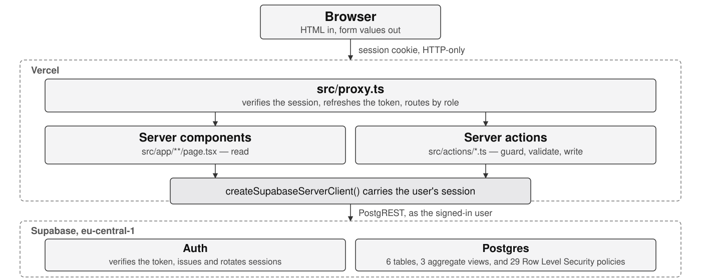

# Technical explainer

The internal document: how this application is put together, what each part is responsible for, and
what happens between a click and a row. It names real files and real functions throughout, so every
claim can be checked by opening the file next to it.

Read [docs/08-study-guide.md](08-study-guide.md) first if you want the concepts before the map.

---

## 1. The architecture



The same picture in text, because a diagram that cannot be drawn on a whiteboard is not understood:

```text
  Browser
    |  HTML, and form submissions as server action calls
    v
  Vercel  ---------------------------------------------------------------
    |                                                                    |
    |  src/proxy.ts        runs first on every request:                  |
    |                      refreshes the session, routes by role         |
    |                                                                    |
    |  Server components   read data           Server actions   write data
    |  src/app/**/page.tsx                     src/actions/*.ts          |
    |        |                                        |                  |
    |        +----------------+-----------------------+                  |
    |                         |                                          |
    |            src/lib/supabase/serverClient.ts                        |
    |            one client, carrying the user's session                 |
    ---------------------------|------------------------------------------
                               |  PostgREST, as the signed-in user
                               v
  Supabase (eu-central-1)
    Auth                verifies the token, issues and rotates sessions
    Postgres            6 tables, 29 policies, 3 views, constraints, triggers
    Row Level Security  decides which rows exist for this user
```

Four things are worth saying about that picture.

**Everything that reads or writes runs on the server.** There is no Supabase client in the browser.
Server components fetch and render; server actions validate and write. The browser gets HTML and
sends form values, and nothing else.

**One client, one identity.** `createSupabaseServerClient` in
[src/lib/supabase/serverClient.ts](../src/lib/supabase/serverClient.ts) builds a client carrying the
signed-in user's session, so every query runs as that user and every policy applies. The only
exception is [src/lib/supabase/adminClient.ts](../src/lib/supabase/adminClient.ts), which bypasses
policies and has exactly one caller, described in section 3.

**The proxy is convenience; the database is the boundary.** `src/proxy.ts` sends a tenant out of
`/landlord` so they do not see a page they cannot use. If it were deleted tomorrow, a tenant asking
for a landlord's rent ledger would still receive nothing, because the policies decide, not the
routing.

**Derived, not stored.** Rent status, occupancy and lease lifecycle are computed from the ledger,
the tenancies and today's date every time they are shown. There is no `status` column anywhere that
could drift from the rows it summarises.

---

## 2. The key files

### The session and the acting user

| File | Responsible for |
| --- | --- |
| [src/proxy.ts](../src/proxy.ts) | Runs before every request. Refreshes the session with `getUser()`, reads the role from `profiles`, and redirects: no session to `/login`, wrong area to the right one, `must_change_password` to `/change-password` |
| [src/lib/supabase/serverClient.ts](../src/lib/supabase/serverClient.ts) | The client every page and action uses. Reads and writes the session cookie |
| [src/lib/supabase/middlewareClient.ts](../src/lib/supabase/middlewareClient.ts) | The same, for the proxy, where cookies go onto a `NextResponse` rather than into `cookies()` |
| [src/lib/supabase/sessionCookieOptions.ts](../src/lib/supabase/sessionCookieOptions.ts) | The cookie's flags in one place: `httpOnly`, `sameSite=lax`, `secure` in production |
| [src/lib/supabase/adminClient.ts](../src/lib/supabase/adminClient.ts) | The service-role client. Bypasses every policy. One caller, `tenantAccountActions.ts` |
| [src/lib/authentication/getSignedInProfile.ts](../src/lib/authentication/getSignedInProfile.ts) | The one place the acting user is decided. Verifies the token, then reads the role from `profiles`, never from the token |
| [src/lib/authentication/requireLandlordProfile.ts](../src/lib/authentication/requireLandlordProfile.ts), [requireTenantProfile.ts](../src/lib/authentication/requireTenantProfile.ts) | Throw unless the acting user has that role. The first line of every action |
| [src/lib/authentication/redirectDestination.ts](../src/lib/authentication/redirectDestination.ts) | The pure function behind the proxy's routing, so the rules can be unit tested without a request |

### The rules

| File | Responsible for |
| --- | --- |
| [src/lib/leases/findConflictingLease.ts](../src/lib/leases/findConflictingLease.ts) | Domain invariant 1 in the application: does a proposed tenancy touch an existing one on that unit |
| [src/lib/leases/describeLeaseLifecycle.ts](../src/lib/leases/describeLeaseLifecycle.ts) | Upcoming, active or ended, from two dates and today |
| [src/lib/leases/describeUnitOccupancy.ts](../src/lib/leases/describeUnitOccupancy.ts) | Whether a unit is let, derived from its tenancies |
| [src/lib/rent/buildRentSchedule.ts](../src/lib/rent/buildRentSchedule.ts) | The months a tenancy owes rent for, and what is due on each |
| [src/lib/rent/deriveRentStatus.ts](../src/lib/rent/deriveRentStatus.ts) | Due, partial, paid or overdue, from an amount, a total received and today |
| [src/lib/rent/summariseOutstandingRent.ts](../src/lib/rent/summariseOutstandingRent.ts) | One tenancy's position, and the portfolio total, from figures Postgres summed |
| [src/lib/maintenance/allowedStatusTransitions.ts](../src/lib/maintenance/allowedStatusTransitions.ts) | Which status a request may move to next |
| [src/lib/money/parseCurrencyInputToCents.ts](../src/lib/money/parseCurrencyInputToCents.ts) | Text a person typed into whole agorot, without floating point |
| [src/lib/dates/isoDate.ts](../src/lib/dates/isoDate.ts) | Calendar dates as `YYYY-MM-DD` strings, compared lexicographically |

### The boundary

| File | Responsible for |
| --- | --- |
| [src/lib/validation/](../src/lib/validation/) | One Zod schema per input, imported by both the form and the action. `fieldSchemas.ts` holds the field types that carry logic |
| [src/actions/](../src/actions/) | The twenty server actions. Every write in the product goes through one |
| [src/lib/actionResult.ts](../src/lib/actionResult.ts) | What every action returns, and where an unexpected database failure is logged and turned into one plain sentence |
| [supabase/migrations/20260825122011_core_schema.sql](../supabase/migrations/20260825122011_core_schema.sql) | The tables, constraints, indexes and triggers |
| [supabase/migrations/20260825122721_row_level_security.sql](../supabase/migrations/20260825122721_row_level_security.sql) | The policies, and the `security definer` helpers behind the tenant ones |

### The interface

| File | Responsible for |
| --- | --- |
| [src/app/landlord/layout.tsx](../src/app/landlord/layout.tsx), [src/app/tenant/layout.tsx](../src/app/tenant/layout.tsx) | The role assertion for each area, and the navigation. The profile is read once here and passed down as a prop |
| [src/components/shared/PaginatedTable.tsx](../src/components/shared/PaginatedTable.tsx) | Every list's table and pager, as a server component |
| [src/components/forms/](../src/components/forms/) | `TextField`, `TextAreaField`, `SelectField`: label, hint, error, and the `aria-describedby` wiring |
| [src/components/tenant/loadTenantLease.ts](../src/components/tenant/loadTenantLease.ts) | The tenancy the portal is about, resolved from the session with no identifier in any URL |
| [src/app/globals.css](../src/app/globals.css) | The design tokens. The palette, the five status meanings that the rent, maintenance and lease badges all name, and the type scale. The only place a status meaning becomes a colour |

---

## 3. The flows, traced

### Flow 1: signing in, and being routed by role

1. **The click.** [src/components/authentication/SignInForm.tsx](../src/components/authentication/SignInForm.tsx)
   is a client component. react-hook-form validates against `signInSchema` for immediate feedback,
   then calls the server action `signIn` inside `startTransition`.
2. **The action.** `signIn` in [src/actions/authenticationActions.ts](../src/actions/authenticationActions.ts)
   parses the input again with `signInSchema.safeParse` - the client run was convenience, this run
   is the boundary - and calls `supabase.auth.signInWithPassword`.
3. **The refusal, if it fails.** Every failure returns the same sentence, `SIGN_IN_REFUSED_MESSAGE`,
   so a wrong password and an address with no account are indistinguishable and the form cannot be
   used to discover who has an account.
4. **The session.** Supabase Auth returns an access token and a refresh token; `@supabase/ssr` writes
   them into one cookie through the `setAll` in `serverClient.ts`, which passes them through
   `hardenedSessionCookieOptions`, so the cookie is `httpOnly`, `sameSite=lax` and `secure` in
   production.
5. **Where to go.** The action calls `getSignedInProfile()`, which verifies the user and reads the
   profile row. `mustChangePassword` sends them to `/change-password`; otherwise
   `homePathForRole(profile.role)` gives `/landlord` or `/tenant`, and the action `redirect`s there.
   An account whose profile row is missing is signed out again rather than left in limbo.
6. **The next request.** `src/proxy.ts` runs before it: `getUser()` verifies and rotates the token if
   it has expired, `profiles` supplies the role, and `redirectDestinationForSignedInUser` decides
   whether this path is allowed for that role. `redirectTo` copies any refreshed cookie onto the
   redirect response, or the rotation would be thrown away.
7. **The area.** [src/app/landlord/layout.tsx](../src/app/landlord/layout.tsx) calls
   `requireLandlordProfile()`, which throws for a tenant. That is the assertion that the routing
   held, and it runs even if the routing rules change.

### Flow 2: creating a lease

This is the flow that carries the product's headline rule, so it is worth following twice: once for
the success and once for the refusal.

1. **The form.** [src/components/leases/LeaseForm.tsx](../src/components/leases/LeaseForm.tsx),
   a client component, resolves `createLeaseSchema` with `{ raw: true }` so the submit handler
   receives what the person typed - "6,500.50", not a number - because the server parses the same
   text.
2. **The call.** `submit()` calls `createLease(values)` from
   [src/actions/leaseActions.ts](../src/actions/leaseActions.ts).
3. **Steps 1 and 2, the guard.** `requireLandlordProfile()`. A tenant gets a thrown
   `RoleMismatchError` before anything is read.
4. **Step 3, validation.** `createLeaseSchema.safeParse(input)`. Dates must be real calendar dates,
   the end must be after the start, rent must be positive, the due day must be 1 to 28, money is
   parsed from text into agorot.
5. **Step 4, the business rule.** The action reads the unit
   (`.from("units").eq("id", parsed.data.unitId)`) - a unit belonging to another landlord comes back
   as no rows and produces "That unit was not found", the same answer as a unit that never existed.
   Then `refuseIfDatesAreTaken` loads that unit's tenancies and hands them to the pure function
   `findConflictingLease`. Both endpoint dates are occupied, so a tenancy running to 31 May conflicts
   with one starting on 31 May.
6. **The refusal.** A conflict returns an `errorResult` naming the earliest date that would work:
   "Occupied until 2026-05-31. Free from 2026-06-01." `applyServerFieldErrors` puts those messages
   on `startDate` and `endDate` in the form. Nothing was written.
7. **Step 5, the write.** `.insert({ unit_id, landlord_id: landlord.id, ... })`. `landlord_id` comes
   from the session, never from the payload. Postgres checks `leases_insert_own`, the exclusion
   constraint `leases_no_overlap`, and the check constraints. If two landlords - or one landlord
   clicking twice - race, the second insert fails with `23P01` and `leaseWriteFailure` turns that
   into "This unit was let for part of those dates a moment ago."
8. **Step 6, revalidation.** `revalidateLeasePaths` marks `/landlord`, `/landlord/leases`, the new
   lease's page, the property page and `/tenant` as stale, so the dashboard's occupancy and the
   property's unit list are recomputed on the next visit.
9. **Step 7, the result.** `successResult({ leaseId })`, and the form calls
   `router.push('/landlord/leases/<id>')`.

The rule is enforced twice on purpose: `findConflictingLease` exists to give a good message, and the
exclusion constraint exists to make the guarantee true under concurrency.

### Flow 3: recording a payment

1. **The form.** [src/components/payments/RentPaymentForm.tsx](../src/components/payments/RentPaymentForm.tsx)
   offers the months of the tenancy that can still be paid, with what is outstanding on each - those
   come from the server component that rendered it, not from a fetch in the browser.
2. **The action.** `recordRentPayment` in
   [src/actions/rentPaymentActions.ts](../src/actions/rentPaymentActions.ts). `requireLandlordProfile()`,
   then `buildRecordRentPaymentSchema(currentIsoDateInUtc()).safeParse(input)`. The schema is built
   rather than exported because it needs today's date to refuse a receipt dated in the future: the
   clock is read at the edge and handed in, so no rule asks what day it is.
3. **The business rule.** The lease is read - another landlord's lease is invisible - and
   `refuseIfPeriodIsOutsideLease` uses `isPeriodMonthWithinLease` to reject a month the tenancy did
   not run for.
4. **The write.** `.insert` into `rent_payments` with `landlord_id` and `recorded_by` both taken from
   the session. `recorded_by` is the column a dispute is settled with, so it is never a form value.
   Postgres checks `rent_payments_insert_own`, which requires the row's landlord to be the caller,
   the caller's role to be landlord, and the lease named to belong to them.
5. **Back to the interface.** `revalidateLedgerPaths` invalidates the lease page, the rent overview,
   the dashboard and the tenant's pages. Nothing anywhere stores a status: the next render calls
   `buildRentScheduleWithStatus`, which asks `deriveRentStatus` per month using the totals from the
   view `lease_period_totals`, and the badge changes because the ledger changed.

There is no tenant path into this action at all. There is no tenant insert policy on `rent_payments`,
which is domain invariant 5 expressed in the database rather than in a comment.

### Flow 4: a tenant reporting a problem

1. **The form.** [src/components/maintenance/MaintenanceRequestForm.tsx](../src/components/maintenance/MaintenanceRequestForm.tsx)
   collects a title, a description and an urgency. It sends no identifier of any kind.
2. **The action.** `submitMaintenanceRequest` in
   [src/actions/maintenanceRequestActions.ts](../src/actions/maintenanceRequestActions.ts) calls
   `requireTenantProfile()`, parses with `submitMaintenanceRequestSchema`, then
   `findTheTenantsActiveLease(...)`, which reads `leases` with no filter naming a lease or a tenant.
   Row Level Security returns the one this user is the tenant of.
3. **The write.** `lease_id` and `landlord_id` come from that lease, `submitted_by` from the session.
   There is nothing in the payload that could point at another flat, which is why this action needs
   no ownership check of its own.
4. **Both sides update.** `revalidatePath` is called for `/landlord`, `/landlord/maintenance`,
   `/tenant` and `/tenant/maintenance`: the landlord's dashboard count and list, and the tenant's own
   list, are all stale now.
5. **The rest of the route.** The landlord moves the request along with
   `updateMaintenanceRequestStatus`, which checks `allowedStatusTransitions` before writing, and
   resolving sets `resolved_at` in the same statement because the check constraint
   `maintenance_requests_resolved_at_matches_status` treats "resolved" and "has a resolution date" as
   one fact. The tenant then confirms with `confirmMaintenanceRequestResolved`, the narrowest write
   in the product: the policy allows it only on their own request, only while it is `resolved`, only
   while `tenant_confirmed_at` is null, and the trigger
   `maintenance_requests_tenant_confirms_only` rejects the update if any other column changed.

### Flow 5: a tenant loading their portal

1. **The request.** `src/proxy.ts` verifies the session, reads the role, and lets `/tenant` through
   for a tenant. [src/app/tenant/layout.tsx](../src/app/tenant/layout.tsx) calls
   `requireTenantProfile()`.
2. **The tenancy.** [src/app/tenant/page.tsx](../src/app/tenant/page.tsx) calls `loadTenantLease()`,
   which selects from `leases` with the unit, the property and the landlord's name joined, ordered by
   start date, **with no filter naming a lease or a tenant**. The policy `leases_select_as_tenant`
   returns only the rows where `tenant_profile_id` is this user. `chooseCurrentLease` picks the one
   the portal is about; a tenant with none gets `null`, which the page renders as a sentence rather
   than an error.
3. **The rent position.** [src/components/tenant/TenantRentPosition.tsx](../src/components/tenant/TenantRentPosition.tsx)
   reads `lease_period_totals` for that lease - one row per month with anything paid, summed by
   Postgres - and calls `buildRentScheduleWithStatus`, the same function the landlord's lease page
   uses. Both sides of the product agree about what is owed because they run the same code over the
   same rows.
4. **Streaming.** The page returns its shell immediately and the rent panel arrives inside a
   `Suspense` boundary, which is why the deployed site sends response headers in about 67 milliseconds
   and completes in under a second.
5. **Why no identifier is in the URL.** There is no `/tenant/lease/[id]`. There is nothing to change
   in the address bar, so there is no way to ask for another tenant's tenancy in the first place. The
   one tenant route that takes parameters is the statement's month range, and
   `chooseStatementRange` clamps it inside the tenancy's own dates.

---

## 4. The database

Six tables. Every one of them carries `created_at` and `updated_at`, and `updated_at` is maintained
by the trigger `set_updated_at` rather than by any application code.

| Table | Why it exists | How it relates |
| --- | --- | --- |
| `profiles` | The application's view of an account: role, name, email, whether a password must be changed. `auth.users` belongs to Supabase and cannot carry product columns | Primary key **is** the `auth.users` id, so `auth.uid()` compares directly in every policy. Created by the trigger `create_profile_on_auth_user_insert` |
| `properties` | A building | `landlord_id` to `profiles`, cascade |
| `units` | The thing that is actually let. A house is a property with one unit | `property_id` to `properties`, cascade. `landlord_id` denormalised. `unique (property_id, label)` |
| `leases` | A tenancy: who rents which unit, for how long, at what rent, due on which day | `unit_id` to `units`, restrict. `tenant_profile_id` nullable, set null on delete: the tenancy is a fact about a unit, not about a login |
| `rent_payments` | The ledger. Every derived rent figure in the product is computed from these rows | `lease_id`, restrict. `recorded_by` says who entered it |
| `maintenance_requests` | A reported problem and its route from `submitted` to `resolved`, plus the tenant's confirmation | `lease_id`, restrict - the tenancy is what makes both parties able to see it. `submitted_by`, restrict |

### Why the schema is shaped this way

**There is no `status` column on `leases`, and no `is_occupied` on `units`.** The obvious
alternative is to store both and update them when things change. Every stored summary is a value
that can disagree with the rows it summarises: a lease that ended yesterday would still say
"active" until something ran. Instead `describeLeaseLifecycle` and `describeUnitOccupancy` compute
them from the dates and today, so they are right at every instant and there is nothing to keep in
step.

**There is no `rent_periods` table.** The obvious alternative is a row per month per tenancy,
generated when the lease is created. That is a second thing to keep in step with the lease, and it
goes wrong the moment a tenancy is ended early or renewed. `buildRentSchedule` derives the periods
from the lease's dates, and a payment points at a period by the first day of its month, which is why
`rent_payments_period_month_is_first_of_month` is a constraint.

**Overlap is an exclusion constraint, not a check in code.** `leases_no_overlap` is
`exclude using gist (unit_id with =, daterange(start_date, end_date, '[]') with &&)`. An
application check is read-then-write and two concurrent requests can both pass it. Postgres holds
this under concurrency, which is why domain invariant 1 is a guarantee rather than an intention.
The `'[]'` is deliberate: both endpoint dates belong to the tenancy.

**Money is an integer of agorot.** Storing 6500.50 as a float and adding it up is how ledgers
develop rounding errors. `parseCurrencyInputToCents` turns typed text into 650050 without ever
multiplying a float, and `formatCentsAsCurrency` turns it back for display.

**Dates are `date`, and `YYYY-MM-DD` strings in the application.** Never `Date` objects: a
`Date` is an instant in a time zone, and "the tenancy ends on 31 May" is not an instant. Strings in
that format also sort lexicographically, so comparisons are the same in SQL and in TypeScript.

**`landlord_id` is denormalised onto `units`, `leases`, `rent_payments` and
`maintenance_requests`.** It could be reached by joining back to `properties` every time. Every
policy would then be a join, on every row, for every query. One column makes each landlord policy
`landlord_id = auth.uid()`, which is both faster and far easier to read - and it cannot drift,
because ownership never transfers in this product.

**The due day is capped at 1 to 28.** Every month has a 28th. That single constraint removes all
month-length arithmetic from the rent schedule.

**Three views, all `security_invoker`.** `lease_rent_summary`, `lease_period_totals` and
`rent_collected_by_month` do the summing in Postgres so that no screen reads a ledger row by row.
`security_invoker = on` makes them run under the caller's policies; without that one word a view
would be a hole straight through the policies underneath it.

### The policies

29 policies over 6 tables. Every landlord policy has the same shape, `landlord_id = auth.uid()` in
both `using` and `with check`, plus a role check. Every tenant policy goes through a
`security definer` helper - `is_current_tenant_lease`, `is_current_tenant_active_lease`,
`is_current_tenant_unit`, `is_current_tenant_property`, `landlord_of_current_tenant_lease` - each of
which answers one boolean question and cannot be used to read anything. They are `security definer`
because a tenant cannot read `leases` freely enough to answer the question themselves, and because a
policy on `profiles` that reads `profiles` would recurse.

Two things a policy cannot do are done by triggers: `profiles_role_is_immutable` freezes a role, and
`maintenance_requests_tenant_confirms_only` limits the tenant's confirmation to one column. A policy
chooses rows; it does not choose columns.

---

## 5. The tests

| Suite | Command | Size | What it proves |
| --- | --- | --- | --- |
| Unit and component | `npm test` | 346 tests, 31 files, ~3s | The derived rules are right, including their boundaries: the day a tenancy ends is still occupied, a partial payment is partial and not overdue until its due day passes, money parses without floating point. Then that forms render their fields, announce their errors to a screen reader, and put a server-side error next to the right input |
| Database and permissions | `npm run test:db` | 134 tests, 7 files, ~35s | That the policies and constraints actually hold, against a real Postgres, as real signed-in users |
| End to end | `npm run test:e2e` | 22 tests, ~3min | That the whole processes work in a browser: the landlord's golden path, the tenant's, and the negative paths - an overlapping tenancy refused, invalid forms, a tenant sent out of a landlord route, every protected route while signed out |
| Deployment smoke | `PLAYWRIGHT_BASE_URL=… npx playwright test e2e/deploymentSmoke.spec.ts` | 7 tests | That the deployed thing works at its real address, read only. Skipped in an ordinary run for the reasons recorded under MAN-05 in the test specification |

### Why the authorisation tests attack the database, not the interface

This is the question most worth being able to answer.

A test that drives the interface can only prove that the interface did not offer a way in. It cannot
distinguish "the policy refused this" from "the page never rendered a link to it". Someone who wants
another landlord's ledger is not going to use the page.

So [tests/](../tests/) does what an attacker would do. It signs in as landlord A with a real password
and a real anonymous key, and then asks PostgREST directly for landlord B's rows - by id, by filter,
through the aggregate views, with updates and deletes as well as selects. There is no page, no
component and no action in the way; the only thing that can refuse is Postgres. `tests/serverActions.test.ts`
does the same to the actions, calling them the way a forged request would rather than through a form.

Three properties of the suite matter as much as its coverage:

- **A positive control.** Landlord A performs the whole create, read, update and delete cycle on
  their own rows. Without it, a policy that refused everything would pass the isolation tests.
- **A guard.** `tests/support/testDatabase.ts` compares the project reference in `.env.test` against
  production's and throws before any client is built. These tests sign real users in and write real
  rows.
- **Refusals proved in the same words.** Two tests assert that another landlord's identifier produces
  exactly the message a missing record produces, because a different message would confirm the row
  exists.

---

## 6. The technical decisions, and how to defend them

Drawn from [docs/decisions.md](decisions.md), which records all of them with their alternatives.

**Row Level Security is the authorisation boundary.** *Alternative:* check ownership in the
application and trust it. *Why:* an application check protects the paths you remembered to check;
a policy protects the table. If a page forgets its filter, the query returns no rows instead of
somebody else's. *If challenged - "isn't that just defence in depth?":* no, it is the reverse. The
application checks are the convenience layer, and they exist to produce good error messages. The
database is the layer that is load bearing, and `npm run test:db` is what proves it.

**Rent status is derived, never stored.** *Alternative:* a `status` column updated when a payment
lands. *Why:* status depends on today's date as well as the ledger, so a stored value is wrong the
morning after it is written unless something runs to fix it. *If challenged - "isn't recomputing
expensive?":* the sums are done by Postgres in three `security_invoker` views, so a lease page reads
one row per month rather than one per payment, measured at 82 ms with 7,200 payments in the table.

**Overlap is an exclusion constraint.** *Alternative:* the application check alone. *Why:*
read-then-write loses a race; two requests can both find the dates free. *If challenged - "when
would that ever happen?":* it does not have to be common to be wrong, and the cost of holding it in
the schema is one line. The application check stays because it produces a message naming the
earliest free date; the constraint is what makes the invariant true.

**The tenant portal takes no identifier from the URL.** *Alternative:* `/tenant/lease/[leaseId]`,
authorised by a policy. *Why:* the policy would refuse another tenant's lease, but the safest URL is
one with nothing in it to change. `loadTenantLease` resolves the tenancy from the session, and the
end-to-end tests try to construct a URL to another tenant's data and cannot.

**The role is read from `profiles`, never from the token.** *Alternative:* put the role in the JWT
and read it there, which is faster. *Why:* a signed-in user can edit their own token metadata
through the Auth API. They cannot edit their profile row, because `profiles_role_is_immutable`
refuses it. *If challenged - "that is an extra query per request":* yes, and section 2 of the scale
document prices it and puts fixing it fourth on the list.

**Tenant accounts are created by the landlord with a one-time temporary password.** *Alternative:*
email invitations. *Why:* there is no email service in this project, by design - a student project
that depends on a mail provider stops working when a trial ends. *If challenged - "what is the
residual risk?":* the password travels through whatever channel the landlord already uses, and until
the tenant changes it the landlord knows a working password for their account. It is stated plainly
in the security document, and the forced change on first sign-in is what closes the window. That
change demands the temporary password itself, so knowing the account exists is not enough to set a
new one.

**Reads in server components, writes in server actions, no route handlers.** *Alternative:* a REST
API under `/api`. *Why:* an API would be a second surface to authorise, and every one of its
endpoints would need the checks the actions already have. There is exactly one route handler,
`/api/health`, because a scheduler calls it and it answers JSON.

**Actions return a result; they never redirect.** *Alternative:* redirect from inside the action.
*Why:* a redirect throws, which makes an action hard to test and impossible to handle at the call
site. Every action returns a discriminated union, and the form decides what to do with it. The two
exceptions are the authentication actions, where the redirect **is** the outcome.

**Money is integer agorot, parsed from text.** *Alternative:* a decimal or float column. *Why:*
floating point addition is not associative and a ledger is nothing but addition. *If challenged -
"Postgres has numeric":* it does, and it would work; integers make the whole path, including
JavaScript, exact rather than only the database half.

**The seed is a Node script, not SQL.** *Alternative:* `seed.sql`. *Why:* accounts have to be
created through the Auth admin API, and inserting into `auth.users` by hand means reproducing
password hashing and a schema owned by Supabase.

**Two Supabase projects.** *Alternative:* one project, with tests cleaning up after themselves.
*Why:* the permission tests sign real users in and write real rows, and a cleanup that fails leaves
test tenancies in the portfolio people are shown. Both the database suite and the Playwright config
refuse to start if pointed at production.

**The session cookie is HTTP-only, against the library's default.** *Alternative:* leave
`@supabase/ssr` as it is. *Why:* the library leaves the cookie readable so its browser client can
hydrate from it, and this project has no browser client, so the default was paying an XSS cost for
a feature never used. *If challenged - "does that make XSS a non-issue?":* no. An injected script
can still act as the user through the application, because the browser attaches the cookie whether
or not JavaScript can read it. What the flag stops is the session being stolen and used elsewhere,
later.
